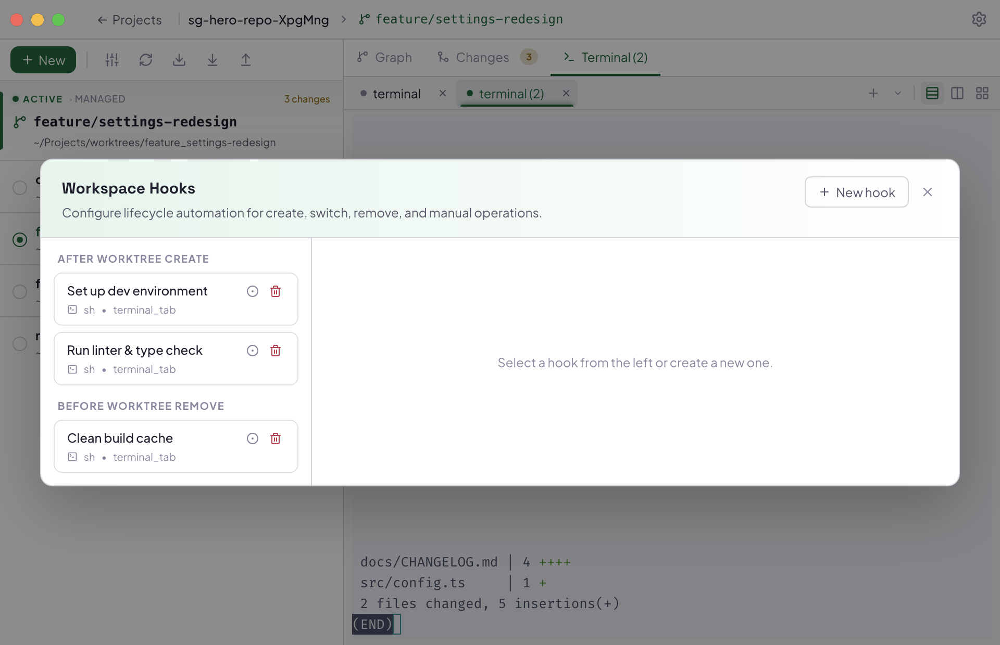

A **hook** is a shell script SproutGit runs automatically at a point in a
worktree's lifecycle — after creating one, before removing one, when
switching into or out of one, and so on. Hooks are useful for anything you'd
otherwise do by hand every time: installing dependencies, running a linter,
starting a dev server, cleaning up build artifacts.

## Two sources, one shape

Local and repo hooks are stored **the same way** — a JSON file of hook
definitions — just in different files with different write and trust
policies:

| | Local hooks | Repo hooks |
|---|---|---|
| File | `<workspace>/.sproutgit/local-hooks.json` | `<worktree>/sproutgit.hooks.json` |
| Tracked by git? | No — private to this machine | Yes — travels with clone/pull |
| Editable from | The app's Workspace Hooks UI | Only by editing the file and committing |
| Shown in the UI with | — | A "repo" badge and a lock icon |
| Trust | Always trusted | Must be trusted per hook before it runs |

Hooks are identified by name within their own file, and a hook's dependency
list (`dependsOn`, for ordering) can only reference other hooks in that same
file — a local hook can't depend on a repo hook or vice versa.

## Why repo hooks need trust

A repo hook arrives on your machine however the repo's contents arrive —
`git clone`, `git pull`, checking out a branch someone else pushed. If
SproutGit ran repo-shipped scripts automatically, cloning a malicious repo
would be enough to execute arbitrary code on your machine. So:

- Repo hooks are surfaced in the UI but **do not run** until you explicitly
  trust them.
- Trust is tracked **per hook**, not per file — trusting one hook doesn't
  trust the rest, and editing or adding a new hook to the file doesn't
  invalidate trust you already gave the others. Each hook's trust is keyed
  to a hash of that hook's own content, so if someone changes a trusted
  hook's script, it reverts to untrusted and you're asked again.
- Local hooks skip this entirely — nothing external ever wrote them, so
  there's nothing to trust.

## When hooks run

Each hook has a **trigger** — `before`/`after` paired with
`worktree_create`, `worktree_remove`, or `worktree_switch` — plus a manual
trigger you can run on demand. Local and repo hooks that match the same
trigger all run together; nothing is deduplicated between the two sources.

## Where a hook runs

A hook's **execution target** decides which worktree's directory it runs
in:

- **Trigger worktree** — the worktree the trigger fired for (e.g. the one
  just created).
- **Initiating worktree** — the worktree you were in *before* the action
  (relevant for switch hooks — there's no "initiating" worktree for a
  create/remove that didn't originate from switching).
- **Workspace root** — the workspace folder itself, not any particular
  worktree.

## Auditing what ran

Every hook run — which hook, which worktree, exit status — is recorded in
the workspace's `state.db` audit log, so you can see what actually executed
and when, not just what's configured to run.

See [Writing hooks](/docs/guides/writing-hooks/) for how to author one.

