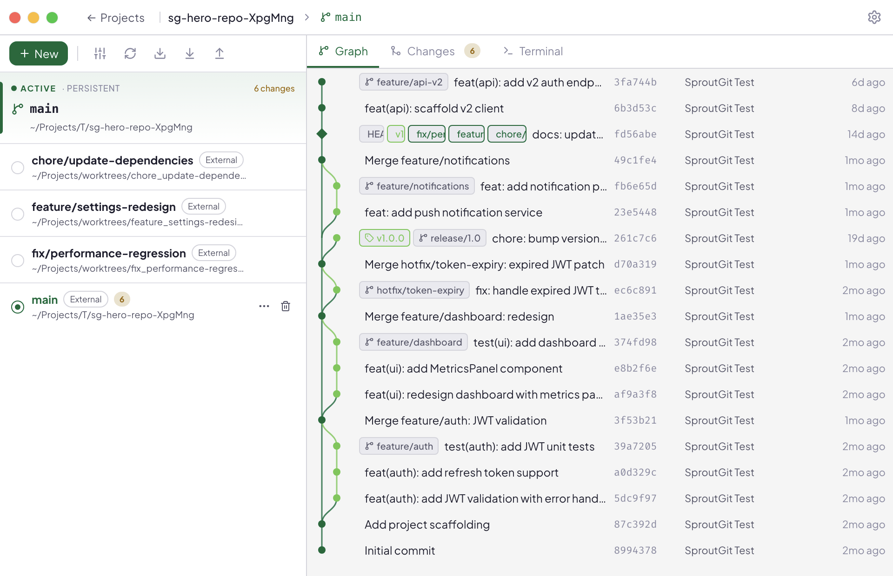

Most Git GUIs treat a branch as the thing you work in: check one out, and
your single working directory changes underneath you. SproutGit treats
[git worktrees](https://git-scm.com/docs/git-worktree) as the primary unit
instead — every branch you're actively working on gets its own real
directory on disk, all linked to the same underlying repository.

## Why this matters

Switching branches the traditional way means stashing or committing
whatever you were mid-way through, then unstashing it later and hoping
nothing collides. With a worktree per branch, there's nothing to stash —
each piece of work just keeps its own files, its own build output, its own
running dev server, until you're ready to come back to it.

This matters even more once AI coding agents are in the loop. Point an
agent at a worktree and it can read, edit, run, and commit inside that
directory without ever touching what you (or another agent) are doing in a
different worktree of the same repo. Traditional single-checkout branch
workflows break down here, because agents end up fighting over the same
working directory.

## What a worktree gets you in SproutGit

Every worktree in the sidebar has its own:

- **Commit graph** — lane-based history with worktree markers, so you can
  see where each worktree's branch sits relative to the others.
- **Changes / diff view** — staged and unstaged files, independent of what's
  staged in any other worktree.
- **Integrated terminal** sessions — a worktree's terminals are scoped to
  that worktree's directory.
- **Coding agent launches** — an agent you [configure once](/docs/guides/coding-agents/)
  can be launched into any worktree, tagged with a live-session badge while
  it runs.
- **Hooks** — lifecycle scripts that run when *this* worktree is created,
  switched to, switched away from, or removed. See
  [Hooks & the trust model](/docs/concepts/hooks-and-trust/).

## Managed vs. externally-managed worktrees

Worktrees SproutGit itself created live under `.sproutgit/worktrees/` (see
[Workspace layout on disk](/docs/concepts/workspace-layout/)) and are fully
managed — SproutGit owns their lifecycle. But if something else adds a
worktree to the same repository — for example, an AI agent running its own
`git worktree add` outside the app, or the app's own
[MCP server](/docs/guides/mcp-server/) tools — SproutGit adopts it
automatically on the next refresh: it shows up in the sidebar with a
distinct icon, and works the same as a managed worktree for terminals,
diffs, hooks, and agent launches. Removing an adopted worktree from
SproutGit never deletes its branch.

