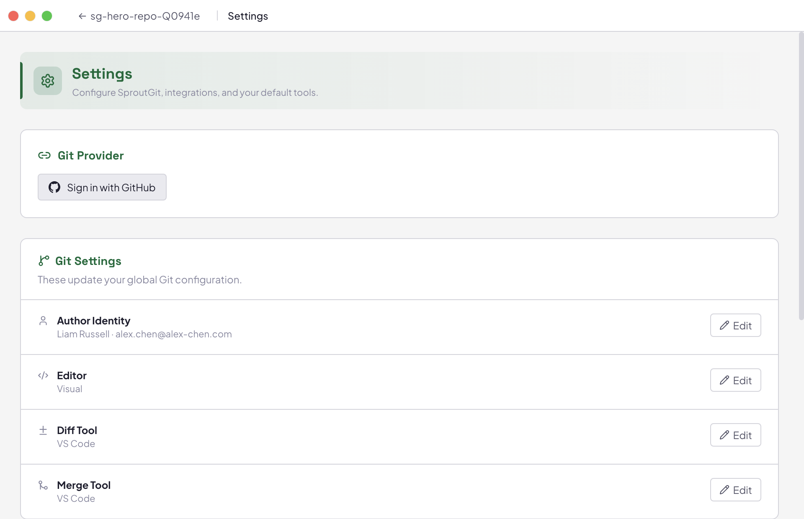

Every open workspace can run its own [MCP](https://modelcontextprotocol.io)
(Model Context Protocol) server, letting any MCP-capable agent — not just
the one you've configured as your default coding agent — list worktrees,
check status, and (once enabled) create or remove worktrees, directly
through its own tool-calling interface.

## Enabling it

Open **Settings → MCP Server** with a workspace open, and toggle **Enable
for this workspace**. Once running, the panel shows the live endpoint:

```
http://127.0.0.1:<port>/mcp
```

The port defaults to a value derived from your workspace path, so it stays
stable across app restarts (and won't collide with another open workspace's
server) — you can override it in the **Port** field if something else on
your machine is already using the default.

## Security model

The server only binds to `127.0.0.1` — it's never reachable from the
network. Since a loopback TCP port (unlike a Unix socket) is still reachable
by *any* process on your machine regardless of user, every request also
needs a per-workspace bearer token in an `Authorization: Bearer <token>`
header. The `Host` header is validated too, which defeats DNS-rebinding
attacks from a malicious webpage trying to reach it through your browser.

## Connecting a client

Click a client's button under **Connect an agent** to have SproutGit write
its connection details directly into that client's config:

| Client | Config file written |
|---|---|
| Claude Code | `.mcp.json` (workspace root) |
| Cursor | `.cursor/mcp.json` (workspace root) |
| Kiro | `.kiro/settings/mcp.json` (workspace root) |
| Gemini CLI | `~/.gemini/settings.json` (user-level) |
| Codex CLI | `~/.codex/config.toml` (user-level) |

Gemini and Codex configs are user-level rather than per-workspace, so
SproutGit names the server entry `sproutgit-<workspace-folder-name>` to
avoid collisions if you have more than one workspace connected at once.

For any other MCP client, use **Copy manual config** to copy a ready-made
JSON (or TOML, for Codex-style clients) snippet with the URL and auth header
already filled in, and paste it into that client's own config file.

## Available tools

| Tool | What it does |
|---|---|
| `list_worktrees` | Lists every git worktree in the workspace, including branch, HEAD, and whether it's externally managed. |
| `get_workspace_info` | Returns the workspace root, git repo path, managed worktrees path, and worktree count. |
| `get_worktree_status` | Returns staged/unstaged/untracked files for one worktree (must be one already returned by `list_worktrees`). |
| `create_worktree` | Creates a new managed worktree from a ref. |
| `remove_worktree` | Removes a managed worktree, optionally deleting its branch. |

`create_worktree` and `remove_worktree` go through the exact same code path
as creating/removing a worktree from the UI — including running any
[hooks](/docs/guides/writing-hooks/) configured for that lifecycle event.

:::note
`create_worktree` and `remove_worktree` are **currently disabled for every
workspace, with no way to turn them on yet** — there's no permission-gate
setting for them in the app yet, so they unconditionally refuse. The
read-only tools (`list_worktrees`, `get_workspace_info`,
`get_worktree_status`) always work once the server is enabled.
:::


